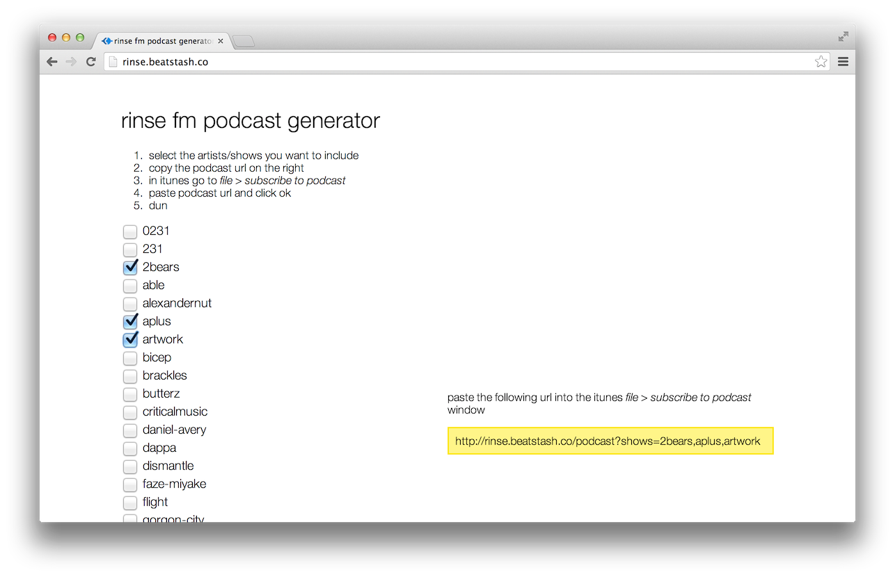

# Rinse FM feed
Generates iTunes-compatible podcast feeds for [Rinse FM](http://rinse.fm/) via scraping.

Built using [React](http://facebook.github.io/react/), [LevelUP](https://github.com/rvagg/node-levelup), and [podcastgen](https://github.com/jsdf/podcastgen)

Try it at [rinse.beatstash.co](http://rinse.beatstash.co)

